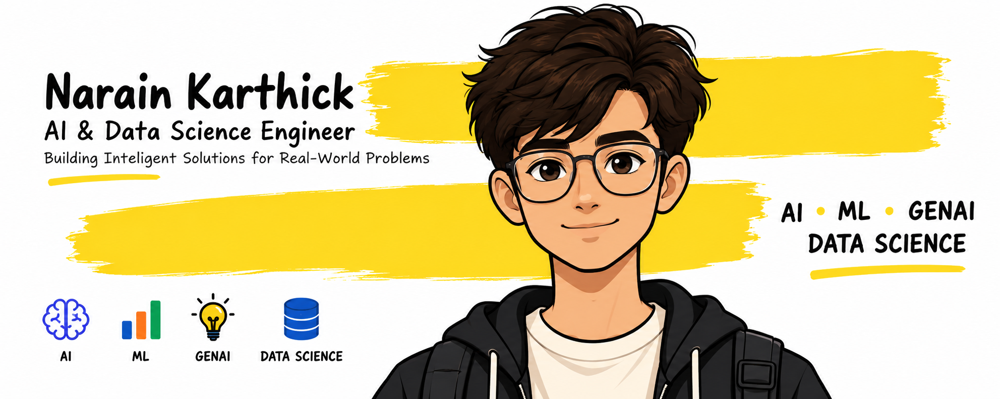

<p align="center">
  
</p>

<h1 align="center">Hi 👋, I'm Narain Karthick</h1>

<h3 align="center">
  🤖 AI & Data Science Student | Aspiring AI Engineer
</h3>

<p align="center">
  <b>Building intelligent solutions for real-world problems.</b>
</p>


<p align="center">
  <a href="https://www.linkedin.com/in/narain-karthick/">
  
</a>

</p>

</p>

---

## 👨‍💻 About Me

I'm an **Artificial Intelligence & Data Science Engineering student** passionate about building practical AI solutions.

My interests include **Machine Learning, Generative AI, Computer Vision, Data Science, AI Agents, and NLP**.

I enjoy taking a real-world problem, understanding it, and turning it into a working technology solution.

- 🎓 Artificial Intelligence & Data Science Engineering Student
- 🤖 Aspiring AI Engineer
- 🧠 Exploring Generative AI, RAG & AI Agents
- 📊 Interested in Machine Learning & Data Science
- 💻 Building AI-powered applications and full-stack systems
- 🏆 Hackathon participant and project builder
- 🌱 Currently strengthening DSA & problem-solving skills

---

## 🧠 Areas of Interest

<p align="center">

`Artificial Intelligence` • `Machine Learning` • `Generative AI`

`Computer Vision` • `Data Science` • `AI Agents` • `NLP`

</p>

---

## 🛠️ Tech Stack

### 💻 Programming


### 🤖 AI & Data Science


### 🌐 Development


### 🗄️ Databases & Cloud


### 🔧 Tools


---

# 🚀 Featured Projects

## 🏙️ CivicShield AI

### Closed-Loop Civic Incident Intelligence & Resolution Verification

An AI-powered civic intelligence platform that converts scattered citizen complaints into unified, actionable and verifiable civic incidents.

### Key Features

- Multimodal complaint processing
- Incident fusion
- Root-cause analysis
- Department & priority prediction
- Resolution verification
- Resolution Integrity Score

**Focus:** AI • Computer Vision • NLP • Geospatial Intelligence • CivicTech

---

## 🗳️ Secure Online Voting DApp

### Blockchain-Based Voting System

A decentralized voting application designed to provide a transparent and tamper-resistant voting process.

**Tech:** Solidity • Ethereum • Ganache • MetaMask • Ethers.js • HTML • CSS • JavaScript

---

## 🍱 Food Donation Portal

A web platform designed to connect food donors with organizations and people who can make use of surplus food.

**Focus:** Full-Stack Development • Database Management • Social Impact

---

## 🎤 Prep2Hire

### AI-Powered Interview Preparation Platform

An AI-powered platform designed to help candidates prepare for interviews through resume analysis, job-description matching and intelligent interview workflows.

**Tech:** Python • FastAPI • AI • NLP • Resume Analysis

---

# 🏆 Achievements & Experience

- 🥇 **1st Place** — Science & Innovation Project Competition
- 🏆 **Top 10** — RMK Innovate Hackathon 2026
- 🏆 **Finalist** — InteroFest Hackathon 2K26
- 💼 **AI & ML Intern** — UptoSkills

---

# 📜 Certifications

- **Oracle Cloud Infrastructure 2025 Certified Data Science Professional**
- **BCG X — Data Science Certification**
- **Infosys Springboard — Data Science Certification**
- **Infosys Springboard — Artificial Intelligence Foundation Certification**

---

# 📚 Currently Learning

```text
Data Structures & Algorithms
          ↓
Machine Learning
          ↓
Deep Learning
          ↓
Generative AI
          ↓
RAG & AI Agents
          ↓
Production AI Applications
```

Currently focusing on strengthening my **DSA, Machine Learning fundamentals, Generative AI knowledge, and ability to build production-ready AI applications.**

---

# 📊 GitHub Stats

<p align="center">
  
  
</p>

<p align="center">
  
</p>

---

# 🎯 My Goal

> **Build AI systems that solve real-world problems — not just demonstrate AI.**

I want to grow into an **AI Engineer** who can combine machine learning, software engineering and problem-solving to build useful intelligent systems.

---

# 🤝 Let's Connect

<p align="center">

<a href="https://github.com/Narain-karthick">
  
</a>

<a href="https://www.linkedin.com/in/narain-karthick/">
  
</a>

</p>

<p align="center">

⭐ Explore my repositories and let's build something meaningful.

</p>
